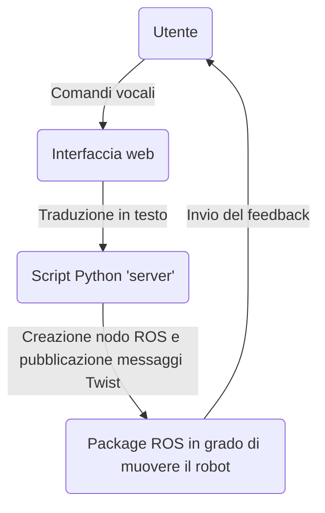

## PILOTARE UN ROBOT TRAMITE COMANDI VOCALI
L'obiettivo dell'applicativo è rendere possibile comandare un robot (in questo caso il [TurtleBot 3 Waffle Pi](https://www.robotis.us/turtlebot-3-waffle-pi/)) mediante una semplice interfaccia web accessibile da qualsiasi dispositivo in modo che chiunque, anche chi non conosce la teoria più complessa che c'è dietro o chi è impossibilitato all'utilizzo di joystick o tastiere, possa comandarne uno.

Il progetto è diviso in tre parti:

 - Un'interfaccia grafica web scritta in **Angular** (framework di Google per la scrittura di applicativi web)
 - Uno script **Python** che si occupa di ricevere i messaggi inviati dal frontend web e di trasformarli in messaggi comprensibili per ROS
 - **Package ROS** con un mondo personalizzato realizzato con Gazebo (un ipotetico ufficio) e il TurtleBot all'interno

 
 
L'architettura dell'applicazione può essere riassunta secondo il seguente schema:

## Prerequisiti necessari e procedure per l'esecuzione

 - **Node.js**, un runtime di Javascript necessario a far funzionare il frontend in Angular (installabile tramite esecuzione dell'istruzione `sudo apt install nodejs` nel terminale)
 - **npm**, packet manager per librerie Javascript (installabile tramite esecuzione dell'istruzione `sudo apt install nodejs` nel terminale)
 - Distribuzione di ROS che supporti Python > 3.0 (per lo sviluppo è stata utilizzata la distro *Melodic* con Gazebo
 - Libreria *websockets* per Python installabile tramite `pip install websockets`
 - Framework **Angular** installabile tramite `npm install -g @angular/cli`

Una volta clonato il repository e aver soddisfatto i prerequisiti necessari procedere come segue:

 1. Avviare l'esecuzione del nodo master di ROS tramite l'istruzione da terminale `roscore`
 2. Lanciare da un nuovo terminale il file *./run.sh* per aprire Gazebo caricando il mondo con il TurtleBot all'interno
 3. Lanciare lo script server in Python tramite `python3 server_ros.py`
 4. Posizionarsi nella cartella radice del progetto e installare i moduli indicati nel file package.json tramite l'istruzione `npm install`
 5. Avviare il build dell'applicazione di frontend tramite il comando `ng serve`. Grazie a ciò sarà possibile accedere all'interfaccia all'indirizzo [localhost:4200](localhost:4200)

Per maggiore chiarezza si può far riferimento ai video tutorial.

## Funzionamento dell'applicazione
Per impartire i comandi è necessario accedere all'interfaccia web e cliccare il bottone con l'icona del microfono 
 

I comandi dettati saranno visualizzati nel riquadro del risultato. Se i comandi sono tutti corretti si potrà procedere all'invio tramite bottone dedicato.

Una volta inviati i comandi il robot si sposterà seguendo tali indicazioni (in blu è cerchiata la posizione di partenza, in rosso quella di arrivo)

Sull'interfaccia web avremo un messaggio che ci ricapitola se sono stati eseguiti con successo tutti i comandi

